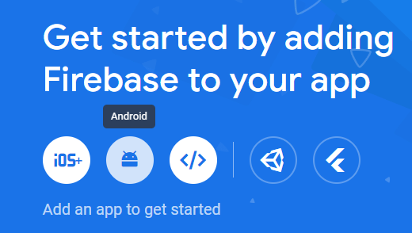
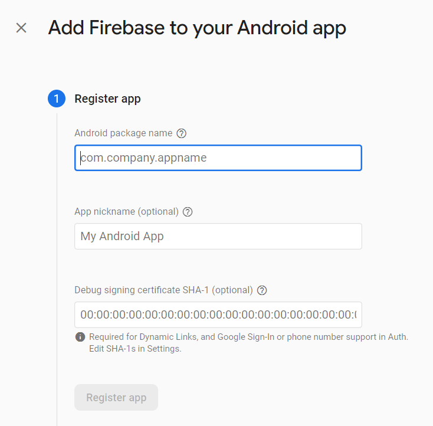

# fcm_example

##Let's play

Create a [firebase](https://console.firebase.google.com/project/) project.

add name and continue

then click on Android



Go to <your-project>/android/app/src/main/AndroidManifest.xml

copy "package" name (if does not have, add it at the end of xmlns: `package="com.example.fcm_example"`)

add it in firebase console



and click on Register app.

download `google-services.json` and put it under /src folder and add next.

To make the google-services.json config values accessible to Firebase SDKs, you need the Google services Gradle plugin.

Add the plugin as a dependency to your project-level build.gradle.kts file:

Root-level (project-level) Gradle file (<project>/build.gradle.kts):

```
plugins {
// ...

// Add the dependency for the Google services Gradle plugin
id("com.google.gms.google-services") version "4.4.0" apply false

}
```

Then, in your module (app-level) build.gradle.kts file, add both the google-services plugin and any Firebase SDKs that you want to use in your app:

Module (app-level) Gradle file (<project>/<app-module>/build.gradle.kts):

```
plugins {
  id("com.android.application")

  // Add the Google services Gradle plugin
  id("com.google.gms.google-services")

  ...
}

dependencies {
  // Import the Firebase BoM
  implementation(platform("com.google.firebase:firebase-bom:32.4.1"))

  // TODO: Add the dependencies for Firebase products you want to use
  // When using the BoM, don't specify versions in Firebase dependencies
  implementation("com.google.firebase:firebase-analytics-ktx")


  // Add the dependencies for any other desired Firebase products
  // https://firebase.google.com/docs/android/setup#available-libraries
}
```

After adding the plugin and the desired SDKs, sync your Android project with Gradle files.

##

