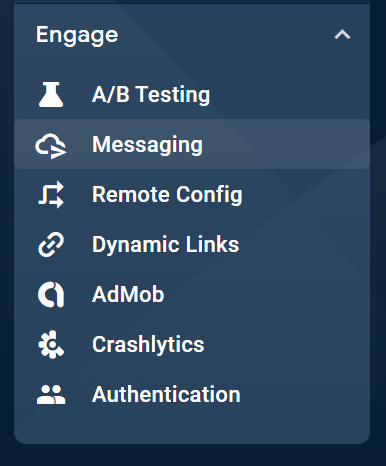
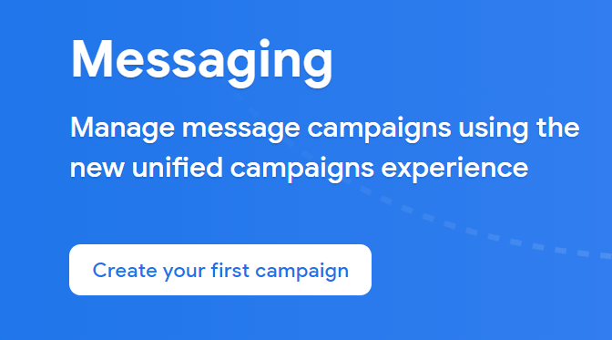
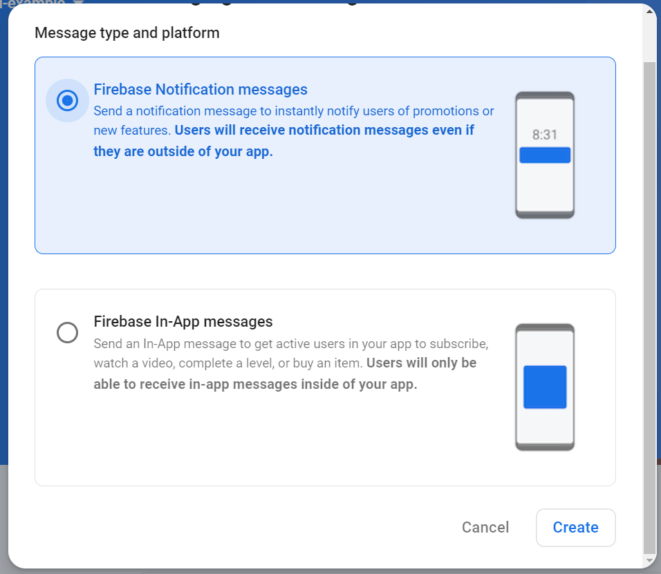
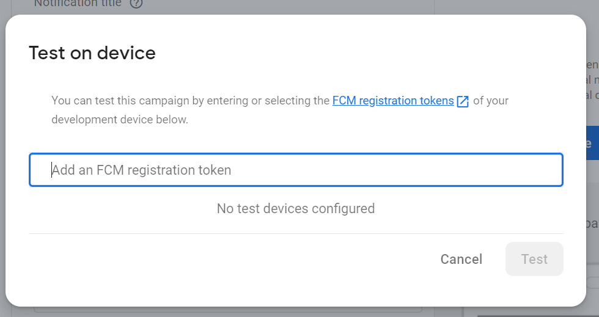

# fcm_example

## Getting Started

Create a [firebase](https://console.firebase.google.com/project/) project.

add name and continue

then click on Android


Go to <your-project>/android/app/src/main/AndroidManifest.xml

copy "package" name (if does not have, add it at the end of xmlns: `package="com.example.fcm_example"`)

add it in firebase console


and click on Register app.

download `google-services.json` and put it under /src folder and add next.

To make the google-services.json config values accessible to Firebase SDKs, you need the Google services Gradle plugin.

Add the plugin as a dependency to your project-level build.gradle.kts file:

Root-level (project-level) Gradle file (<project>/build.gradle):

```
dependencies {
        ...
        classpath 'com.google.gms:google-services:4.4.0'
    }
```

Then, in module (app-level) Gradle file (<project>/<app-module>/build.gradle):

```
plugins {
  
  // Add the Google services Gradle plugin
  id "com.google.gms.google-services"
}

dependencies {
  // Import the Firebase BoM
    implementation platform('com.google.firebase:firebase-bom:32.4.1')

  // TODO: Add the dependencies for Firebase products you want to use
  // When using the BoM, don't specify versions in Firebase dependencies
  //implementation("com.google.firebase:firebase-analytics-ktx")


  // Add the dependencies for any other desired Firebase products
  // https://firebase.google.com/docs/android/setup#available-libraries
}
```

After adding the plugin and the desired SDKs, sync your Android project with Gradle files.

## Second part

After adding `firebase_api` and changing `main` method after [this commit](https://github.com/FtADev/FCM-Example/commit/4979ec2c8b77e8bf328e074421b6bb11d1dbf157)

you can push a notification from your firebase console 

Go to your project page







After filling the fields click on send test



Here you can add your token (That we were printing on the code) to target that specific device and click on add icon.

put the app in the background (or terminate it) and click on test!